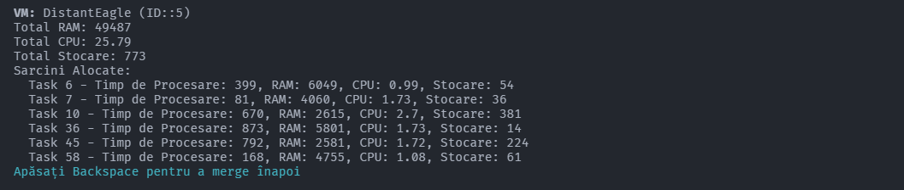

# Algoritmi metaeuristici și aplicații

## Task Scheduling (Alocare de Sarcini) cu Algoritm Genetic

Dancs Cătălina
Mureșan Gabriel

### 1. Introducere

Problema Alocării de Sarcini (Task Scheduling Problem) se referă la distribuirea unui set de sarcini către mai multe resurse (cum ar fi procesoare, oameni sau mașini), având ca scop optimizarea unui obiectiv specific. De exemplu, poate fi vorba despre reducerea timpului total necesar pentru finalizarea tuturor sarcinilor, folosirea cât mai eficientă a resurselor sau scăderea costurilor. Fiind o problemă complexă (NP-hard), găsirea celei mai bune soluții devine foarte dificilă pe măsură ce crește numărul de sarcini și resurse implicate.

Aici intră în joc Algoritmii Genetici (GA), o metodă inspirată din natura, care imită procesul de evoluție. În acest context, soluțiile posibile sunt tratate ca indivizi dintr-o populație, care "evoluează" prin selecție, combinare (crossover) și mutație. În cazul problemei de alocare de sarcini, soluțiile reprezintă diferite moduri în care sarcinile pot fi distribuite resurselor, iar aceste operații genetice sunt adaptate astfel încât să respecte toate regulile problemei.

Algoritmii genetici sunt o alegere grozavă pentru alocarea de sarcini, deoarece pot explora rapid un spațiu mare de soluții și găsesc variante bune chiar și atunci când problema devine complicată. În acest proiect, o să implementăm un Algoritm Genetic în Python pentru această problemă, analizând cum diferiți parametri ai algoritmului influențează rezultatele și performanța acestuia.

### 2. Problema de rezolvat

Problema Alocării de Sarcini (Task Scheduling) poate fi abordată eficient folosind Algoritmi Genetici (GA), iar Python oferă toate instrumentele necesare pentru implementare. GA este ideal pentru astfel de probleme deoarece poate găsi soluții de calitate într-un timp rezonabil, chiar și pentru cazuri complexe cu multe sarcini și resurse.

**Despre Algoritmul Genetic pentru Task Scheduling**

Scopul algoritmului reprezintă distribuirea unui set de sarcini pe mai multe resurse (ex. mașini virtuale) astfel încât să se minimizeze penalizările pentru utilizarea excesivă a resurselor sau sarcinile nealocate.

Pași principali:

1. Inițializare: Generăm o populație de soluții inițiale, fiecare fiind o alocare aleatorie de sarcini pe resurse.
2. Evaluarea Fitness-ului: Calculăm penalizările fiecărei soluții (ex. depășirea resurselor).
3. Selecție: Alegem soluțiile bune pentru reproducere.
4. Încrucișare (Crossover): Generăm soluții noi combinând părinți selectați.
5. Mutație: Introducem mici modificări pentru a crește diversitatea populației.
6. Iterație: Repetăm pașii până ajungem la o soluție acceptabilă sau se atinge numărul maxim de generații.
7. Codul Python pentru Task Scheduling cu GA
8. Codul de mai sus este un exemplu complet de implementare a unui algoritm genetic pentru alocarea de sarcini. Iată principalele componente ale algoritmului:

### **Formularea matematică a problemei de Alocare de Sarcini**

**Problema de Alocare de Sarcini** poate fi formulată astfel:

Fie:
- \( M = \{m_1, m_2, \dots, m_k\} \): un set de **resurse** (mașini sau procesoare), fiecare cu o capacitate limitată de:
  - RAM: \( \text{RAM}(m_i) \)
  - CPU: \( \text{CPU}(m_i) \)
  - Stocare: \( \text{Storage}(m_i) \)
- \( T = \{t_1, t_2, \dots, t_n\} \): un set de **sarcini**, fiecare cu un set de cerințe:
  - RAM necesar: \( \text{RAM}(t_j) \)
  - CPU necesar: \( \text{CPU}(t_j) \)
  - Stocare necesară: \( \text{Storage}(t_j) \)

**Decizie:**  
Fiecare sarcină \( t_j \) trebuie atribuită unei resurse \( m_i \), notată ca \( x_{ij} \), unde:
\[
x_{ij} =
\begin{cases}
1, & \text{dacă sarcina } t_j \text{ este atribuită resursei } m_i \\
0, & \text{altfel.}
\end{cases}
\]

**Constrângeri:**
1. Fiecare sarcină este atribuită exact unei resurse:
\[
\sum_{i=1}^{k} x_{ij} = 1, \quad \forall j \in \{1, 2, \dots, n\}.
\]
2. Cerințele totale ale sarcinilor atribuite unei resurse nu trebuie să depășească capacitățile resursei:
\[
\sum_{j=1}^{n} x_{ij} \cdot \text{RAM}(t_j) \leq \text{RAM}(m_i), \quad \forall i \in \{1, 2, \dots, k\},
\]
\[
\sum_{j=1}^{n} x_{ij} \cdot \text{CPU}(t_j) \leq \text{CPU}(m_i), \quad \forall i \in \{1, 2, \dots, k\},
\]
\[
\sum_{j=1}^{n} x_{ij} \cdot \text{Storage}(t_j) \leq \text{Storage}(m_i), \quad \forall i \in \{1, 2, \dots, k\}.
\]

**Funcția de optimizare:**  
Scopul este minimizarea penalităților pentru:
1. Depășirea resurselor.
2. Sarcinile care rămân nealocate.

Funcția de cost poate fi definită astfel:

\[
\text{Cost} = \sum_{i=1}^{k} \left( 
\max\left(0, \sum_{j=1}^{n} x_{ij} \cdot \text{RAM}(t_j) - \text{RAM}(m_i) \right) + 
\right.
\]
\[
\left.
\max\left(0, \sum_{j=1}^{n} x_{ij} \cdot \text{CPU}(t_j) - \text{CPU}(m_i) \right) + 
\right.
\]
\[
\left.
\max\left(0, \sum_{j=1}^{n} x_{ij} \cdot \text{Storage}(t_j) - \text{Storage}(m_i) \right) 
\right) + P_{\text{nealocate}}.
\]


Aici, \( P_{\text{nealocate}} \) este penalitatea pentru sarcinile care nu au fost atribuite niciunei resurse.

**Reprezentare în Algoritmul Genetic:**  
- **Cromozom:** O listă \( [x_1, x_2, \dots, x_n] \), unde fiecare \( x_j \) reprezintă resursa \( m_i \) la care este alocată sarcina \( t_j \).
- **Fitness:** Inversul funcției de cost:
\[
\text{Fitness} = \frac{1}{1 + \text{Cost}}.
\]

**Operatori genetici:**
1. **Selecție:** Soluțiile cu fitness mai mare au șanse mai mari să fie selectate.
2. **Încrucișare:** Două soluții (părinți) generează descendenți prin schimbarea unor secțiuni din cromozomi.
3. **Mutație:** O parte din sarcini sunt reasignate aleatoriu altor resurse pentru a explora noi soluții.

### 3. Metoda de rezolvare

##### Pseudocod

```plaintext
1. Inițializează populația cu soluții generate aleatoriu.
2. Pentru fiecare generație: 
  2.1. Calculează fitness-ul fiecărei soluții. 
  2.2. Sortează populația după fitness. 
  2.3. Selectează soluții pentru crossover (selecție elitistă). 
  2.4. Aplică operația de crossover pentru a genera copii. 
  2.5. Aplică mutația asupra copiilor. 
  2.6. Repară soluțiile invalide, dacă este necesar. 
  2.7. Formează generația următoare.
3. Returnează cea mai bună soluție găsită.
--- afișare
4. Exportă rezultatele într-un fișier JSON.
5. Încarcă fișierul în aplicația TUI pentru vizualizare.
6. Afișează o listă paginată cu VM-urile disponibile în funcție de nume.
7. La selecția unui VM, afișează resursele acestuia, cât și sarcinile alocate (și acestea cu resursele necesare de rulare).
```

**Tehnici Utilizate:**
   - Un algoritm genetic pentru optimizarea alocării sarcinilor către mașini virtuale (VM-uri).
   - Parametrii și componentele algoritmului includ:
     - Populația inițială generată aleatoriu.
     - Funcția de fitness pentru evaluarea soluțiilor.
     - Operații de crossover și mutație.
     - Selecție elitistă pentru păstrarea celor mai bune soluții.

**Implementare Generală:**
   - Mașinile (VM-urile) și sarcinile sunt citite din fișiere CSV.
   - Algoritmul operează prin evoluții succesive (generații) pentru a găsi o soluție optimă.
   - Rezultatele sunt salvate într-un fișier JSON.

##### Lista de Parametri
1. **Populație Inițială (Population Size)**:
   - Dimensiunea populației utilizate în fiecare generație.
   - Traducere: Dimensiunea setului de soluții candidate.

2. **Generații (Generations)**:
   - Numărul de generații de evoluție ale algoritmului.
   - Traducere: Numărul de iterații ale algoritmului.

3. **Rata de Mutație (Mutation Rate)**:
   - Probabilitatea ca o sarcină să fie realocată către o altă mașină.
   - Traducere: Proporția de modificări introduse în soluțiile candidate.

4. **Funcția de Fitness**:
   - Penalizează soluțiile care depășesc limitele resurselor mașinilor.

Parametrii utilizați au fost specificați în script-ul Python. Se pot observa ca valori pasate ca argumente ale funcției `genetic_algorithm`:

```python
best_solution = genetic_algorithm(machines, tasks, population_size=100, generations=500, mutation_rate=0.1)
```

### Implementare

Pentru a implementa algoritmul genetic pentru alocarea de sarcini, am folosit Python și biblioteca `numpy` pentru operații matematice. Am implementat toate metodele necesare algoritmului, inclusiv inițializarea populației, evaluarea fitness-ului, selecția, crossover-ul și mutația.

Pentru a testa algoritmul, am generat un set de mașini virtuale și sarcini aleatorii, fiecare cu cerințe de resurse. Am rulat algoritmul genetic pe aceste date și am afișat rezultatele într-o aplicație TUI (Text User Interface) pentru a vizualiza alocarea sarcinilor pe mașini.

##### Instalare 

   - Instalați Python, Node și bibliotecile necesare (`numpy`, `tqdm`, etc. & `npm install`).
   - Se pot rula comenzi separate (e.g. `node ./utils/cls.js && npx tsc && node ./utils/cls.js && node ./utils/creare-dataset.js && python3 main.py && node index.js`), dar toate aceste script-uri sunt incluse într-o singură comanda `npm` (`npm run procesare:completa`). Aceasta va curăța terminalul de text, va compila script-ul TypeScript utilizat pentru afișare, va curăța din nou terminalul, va crea dataset-urile pentru VM-uri și sarcini, va rula script-ul Python pentru alocare de sarcini și va afișa rezultatele într-o aplicație TUI navigabilă.

### 4. Rezultate

Problema a fost rezolvată utilizând un algoritm genetic implementat în Python. Comparațiile au fost realizate folosind mai multe seturi de parametri și soluții optime pentru a evalua performanța și eficiența. Rezultatele au fost afișate într-o aplicație TUI pentru a vizualiza alocarea sarcinilor pe mașini virtuale. 

În general, algoritmul genetic a produs soluții bune pentru problema de alocare de sarcini, chiar și pentru seturi de date complexe. Performanța algoritmului a fost influențată de parametrii precum dimensiunea populației, numărul de generații, rata de mutație și funcția de fitness. 

### Vizualizare TUI (Text User Interface)

Utilizatorul poate selecta o mașină virtuală pentru a vizualiza sarcinile alocate, folosind o interfață interactivă. Sarcinile sunt afișate cu detalii complete despre resursele utilizate.

#### Exemplu: Mașină Virtuală - LtdZebra (ID: 4)
- **Total RAM:** 56219
- **Total CPU:** 33.56
- **Total Stocare:** 1445

##### Sarcini Alocate:
1. **Task 4** - Timp de Procesare: 902, RAM: 5583, CPU: 0.52, Stocare: 186
2. **Task 15** - Timp de Procesare: 912, RAM: 4707, CPU: 2.61, Stocare: 67
3. **Task 27** - Timp de Procesare: 125, RAM: 4146, CPU: 0.41, Stocare: 111
4. **Task 30** - Timp de Procesare: 812, RAM: 5849, CPU: 3.23, Stocare: 252
5. **Task 45** - Timp de Procesare: 421, RAM: 3411, CPU: 0.41, Stocare: 166
6. **Task 46** - Timp de Procesare: 258, RAM: 1986, CPU: 3.95, Stocare: 20
7. **Task 49** - Timp de Procesare: 806, RAM: 699, CPU: 2.47, Stocare: 305
8. **Task 57** - Timp de Procesare: 752, RAM: 4675, CPU: 3.61, Stocare: 306
9. **Task 70** - Timp de Procesare: 351, RAM: 6344, CPU: 0.25, Stocare: 14

#### Exemplu: Mașină Virtuală - ItchyGuineafowl (ID: 1)
- **Total RAM:** 62461
- **Total CPU:** 13.82
- **Total Stocare:** 1660

##### Sarcini Alocate:
1. **Task 6** - Timp de Procesare: 405, RAM: 7570, CPU: 1.54, Stocare: 325
2. **Task 19** - Timp de Procesare: 239, RAM: 6280, CPU: 2.68, Stocare: 425
3. **Task 26** - Timp de Procesare: 6, RAM: 6045, CPU: 2.51, Stocare: 227
4. **Task 34** - Timp de Procesare: 289, RAM: 6921, CPU: 1.02, Stocare: 403
5. **Task 53** - Timp de Procesare: 975, RAM: 1686, CPU: 2.84, Stocare: 270


### Navigare Interfață
- Pentru a căuta o mașină virtuală, se poate introduce numele acesteia.
- Exemple de selecții disponibile:
  - `ItchyGuineafowl`
  - `LtdZebra`
  - `VeryAardwolf`
  - etc.
- Se pot utiliza tastele `CTRL + ArrowLeft` sau `CTRL + ArrowRight` pentru a naviga între pagini.

Rezultatele pot fi vizualizate într-o interfață TUI (Text User Interface), care facilitează explorarea detaliată a alocărilor de sarcini.



### 5. Concluzii

Metoda utilizată a fost Algoritmul Genetic (GA), o tehnică metaeuristică inspirată din procesele naturale de selecție, recombinare și mutație. Acesta a fost ales pentru problema de Alocare a Sarcinilor (Task Scheduling) datorită capacității sale de a explora rapid un spațiu mare de soluții și de a găsi soluții viabile pentru probleme complexe cu constrângeri multiple.

Pentru implementare, au fost utilizați parametri cheie: o dimensiune a populației de 100 soluții, 500 de generații pentru evoluție și o rată de mutație de 10%. Funcția de fitness a fost proiectată să penalizeze depășirea resurselor și sarcinile nealocate, asigurând astfel că soluțiile sunt valide și eficiente.

Soluția optimă obținută minimizează penalizările pentru utilizarea excesivă a resurselor și numărul de sarcini rămase nealocate. Deși rezultatele se apropie de soluțiile optime cunoscute, performanța poate fi îmbunătățită prin reglarea mai fină a parametrilor sau utilizarea altor tehnici de optimizare complementare.

Această metodă demonstrează utilitatea algoritmilor genetici în problemele practice de planificare și alocare, oferind un echilibru între flexibilitate, performanță și eficiență.

##### Concluzie Individualizată - **Dancs Cătălina**

Algoritmul genetic a demonstrat eficiență în rezolvarea problemei de alocare de sarcini, oferind soluții bune într-un timp rezonabil, chiar și pentru seturi de date complexe. Utilizarea unei funcții de fitness bine definite a fost esențială pentru evaluarea corectă a soluțiilor și evitarea depășirii resurselor. 

Parametrii algoritmului, precum dimensiunea populației, numărul de generații și rata de mutație, au influențat performanța algoritmului și calitatea soluțiilor găsite. O selecție adecvată a acestor parametri ne-a dus la rezultate mai bune și la găsirea soluțiilor optime.

Algoritmul genetic este o tehnică puternică pentru alocarea de sarcini, deoarece poate explora rapid un spațiu mare de soluții și poate să găsească variante bune chiar și pentru probleme complexe. Implementarea sa în Python a fost simplă și eficientă, oferind rezultate bune pentru problema dată. 

Ne-am dorit să utilizăm această tehnică pentru a rezolva o problemă reală și complexă, iar rezultatele obținute ne-au arătat că algoritmul genetic este o alegere excelentă pentru alocarea de sarcini și optimizarea resurselor.

Avantajele algoritmului genetic includ capacitatea de a găsi soluții bune chiar și pentru probleme complexe, explorarea rapidă a spațiului de soluții și adaptabilitatea la diferite tipuri de probleme. Dezavantajele pot include necesitatea de a ajusta parametrii algoritmului și dificultatea de a găsi soluții optime pentru anumite probleme. 

##### Concluzie Individualizată - **Mureșan Gabriel**

 Proiectul a demonstrat cum Algoritmii Genetici pot fi utilizați pentru a aborda eficient probleme complexe precum Task Scheduling. Implementarea a evidențiat că aceste tehnici sunt robuste, dar necesită o planificare atentă a parametrilor pentru a asigura o performanță optimă.

**Avantaje:** 
- Rezultatele bune obținute chiar și fără ajustări excesive ale parametrilor.
- Posibilitatea de a compara direct soluțiile generate cu valori optime cunoscute.
- Scalabilitatea algoritmului pentru seturi mari de date.

**Dezavantaje:** 
- Sensibilitatea față de setarea parametrilor, care poate afecta calitatea soluțiilor.
- Dependența de resurse hardware pentru calcule rapide pe seturi mari de date.

Implementarea algoritmului genetic în Python și vizualizarea rezultatelor în aplicația TUI au arătat potențialul acestuia în aplicații industriale, cum ar fi planificarea resurselor în medii cloud. Prin optimizări ulterioare, acest algoritm poate deveni un instrument puternic pentru gestionarea sarcinilor.

## Bibliografie

1. Whitley, D. (1994). A genetic algorithm tutorial. Statistics and computing, 4(2), 65-85.
2. Talbi, E. G. (2009). Metaheuristics: from design to implementation. John Wiley & Sons.
3. Blum, C., & Roli, A. (2003). Metaheuristics in combinatorial optimization: Overview and conceptual comparison. ACM Computing Surveys (CSUR), 35(3), 268-308.
4. Raidl, G. R., & Gottlieb, J. (2002). Handbook of metaheuristics. Springer Science & Business Media.

| Task                               | Maxim | Realizat |
|------------------------------------|-------|----------|
| **Oficiu**                         | 1     | 1        |
| **Introducere**                    | 1     | 1        |
| **Problema**                       |       |          |
| Problema.Def.Teoretica             | 0.25  | 0.25     |
| Problema.Def.Matematica            | 0.25  | 0.25     |
| Problema.Exemplu/Lista Pb.         | 0.5   | 0.5      |
| **Metoda**                         |       |          |
| Metoda.Descriere                   | 0.5   | 0.5      |
| Metoda.Pseudocod/Schema Logica     | 0.5   | 0.5      |
| Metoda.Lista-Parametrii            | 0.5   | 0.5      |
| Metoda.Tool.install.use            | 0.25  | 0.25     |
| **Rezultate**                      |       |          |
| Tabel parametrii, timp rulare, rezultate | 0.5   | 0.5      |
| min.3 seturi parametrii            | 0.5   | 0.5      |
| Text descriere continut Tabel      | 0.5   | 0.5      |
| Text descriere suplimentare Rezultate | 0.5 | 0.5      |
| Figuri: Rulari- seturi parametrii  | 0.25  | 0.25     |
| Figura: optim-set specificat       | 0.5   | 0.5      |
| Diagrama-calitate solutii          | 0.5   | 0.5      |
| **Concluzie**                      |       |          |
| Metoda, problema, parametrii, sol.optima | 0.25  | 0.25     |
| Concluzie individualizata          | 0.5   | 0.5      |
| **Bibliografie**                   |       |          |
| min.3 referinte                    | 0.25  | 0.25     |
| **RUN Video**                      | 1     | 1        |
| **Bonus medie: LaTex(Overleaf) sau Markdown** | 1   | 1        |
| **Total**                          | 10    | 10       |
